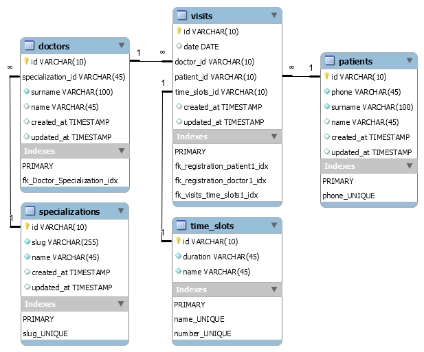

### Допущения и ограничения
Архитектура системы и уровень проработки решения соответствует формату MVP. Разработка системы велась с учетом следующих допущений и ограничений:
1. Клиника имеет один профиль (стоматология);
2. Врач имеет только одну специализацию;
3. График работы клиники  09:00 - 21:00 без перерывов и выходных;
4. График работы всех врачей совпадает с графиком клиники;
5. Все “временные слоты” приема равняются 30 минутам;
6. Регистрация пациентов производится по номеру мобильного телефона.

### Дальнейшее развитие
Предполагается, что в случае дальнейшего развития системы будет внедряться:
1. Функциональность введения личных рабочих графиков врачей (рабочие дни с учетом отпусков, перерывов на обед, не полный рабочий день);
2. Различная продолжительность\количество временных слотов;
3. Пагинация в категориях;
4. Валидация данных на фронте;
5. ReCaptcha на форме регистрации визитов.

### MySQL Workbench model

